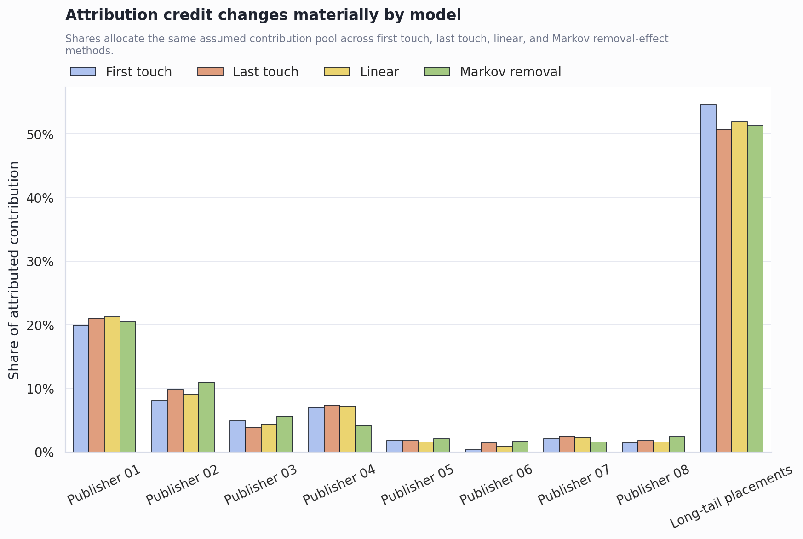
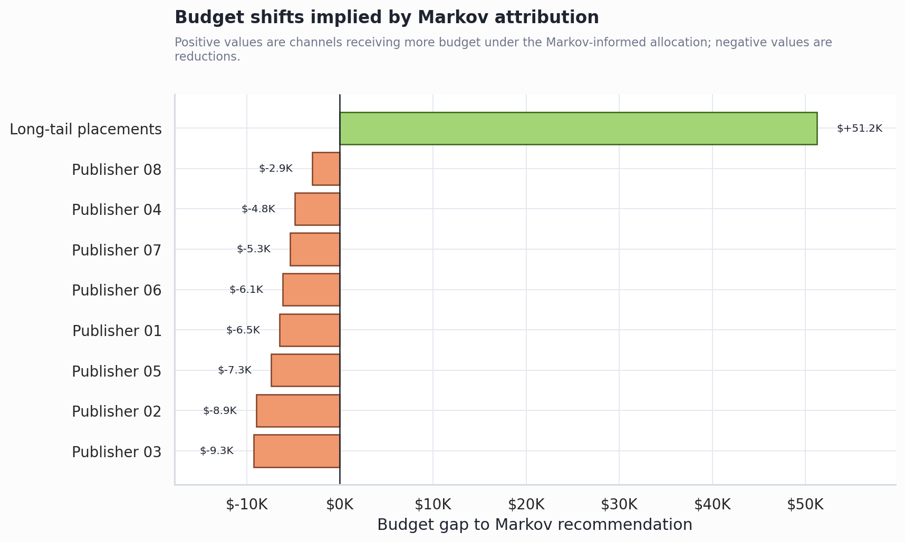
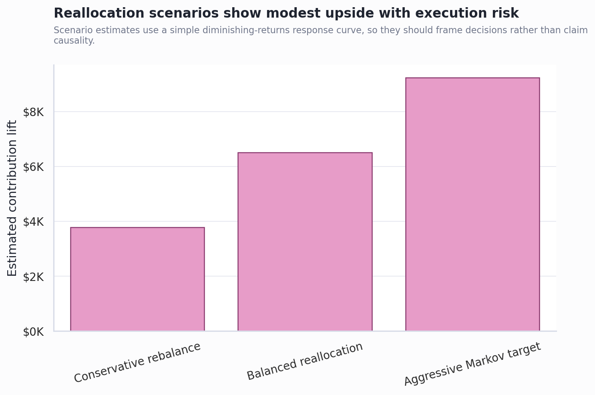

# Marketing Channel Attribution & Budget ROI Strategy

Sourced CriteoPrivateAd sample analysis for a mid-size e-commerce business  
Prepared by Shalom Wu

---

## 1. Problem Framing

Last-touch attribution is easy to explain but risky for budget decisions.

- It gives 100% credit to the final observed channel before conversion.
- That can over-credit demand-capture channels and under-credit channels that created the demand earlier.
- The business problem is not "which channel touched the customer last?" It is "where should the next budget dollar go?"

---

## 2. Key Finding

Attribution method choice materially changes channel credit.

- Markov removal gives Long-tail placements the highest credit at 51.3%.
- Last-touch credits the same channel at 50.7%.
- The sourced Criteo sample contains 11,343 multi-touch journeys and a 1.8% conversion rate.

---

## 3. Cost Of The Status Quo

Using last-touch as the budget guide would misallocate an estimated $8.1K.

- That equals 4.7% of the assumed pilot budget.
- The biggest increase under Markov is Long-tail placements ($51.2K).
- The biggest reduction is Publisher 03 ($-9.3K).

---

## 4. Reallocation Scenarios

Three scenarios translate attribution into operating choices.

| Scenario | Estimated Lift | Incremental ROAS | Tradeoff |
|---|---:|---:|---|
| Conservative rebalance | $3.8K | 0.21x | Move partway toward Markov credit; lowest disruption. |
| Balanced reallocation | $6.5K | 0.20x | Meaningful shift while keeping channel mix diversified. |
| Aggressive Markov target | $9.2K | 0.18x | Fully align budget with Markov credit; highest execution risk. |

---

## 5. Recommended Approach

Use a balanced reallocation, not a full swing to the model.

- Shift 65% of the gap between current spend and Markov-informed spend.
- Expected assumed contribution lift: $6.5K, or 19.0%.
- Keep last-touch reporting for operational diagnostics, but do not use it as the primary budget allocator.
- Validate the recommendation with a holdout or incrementality test before scaling.

---

## 6. Deployment Strategy

1. Keep current tracking taxonomy stable for one quarter.
2. Report first-touch, last-touch, linear, and Markov credit side by side.
3. Move budget in staged increments with guardrails on CPA, margin, and conversion volume.
4. Use experiments to calibrate causal lift where the attribution model suggests material spend shifts.

---

## 7. Appendix: Methodology

- Dataset: processed sample from CriteoPrivateAd public anonymized advertising data.
- Grain: one display impression transformed into one attribution touchpoint.
- Channel definition: anonymized publisher placement groups, with the top eight publishers shown separately and the remaining publishers grouped as Long-tail placements.
- Baselines: first-touch, last-touch, and linear attribution.
- Data-driven model: Markov chain removal effect, which measures conversion-probability drop when a channel is removed from paths.
- Budget model: assumed pilot spend, assumed contribution per sale, Markov credit shares, and a diminishing-returns response curve.

---

## 8. Appendix: Limitations

- Attribution is correlational, not causal.
- The sample is real Criteo data, but the channel names are anonymized and the repo uses one downloaded shard, not the full 100M-row dataset.
- Channel costs, gross margin, customer lifetime value, and saturation would need real business inputs.
- Real deployment should reconcile attribution with incrementality tests, media-mix modeling, and finance-approved contribution economics.
