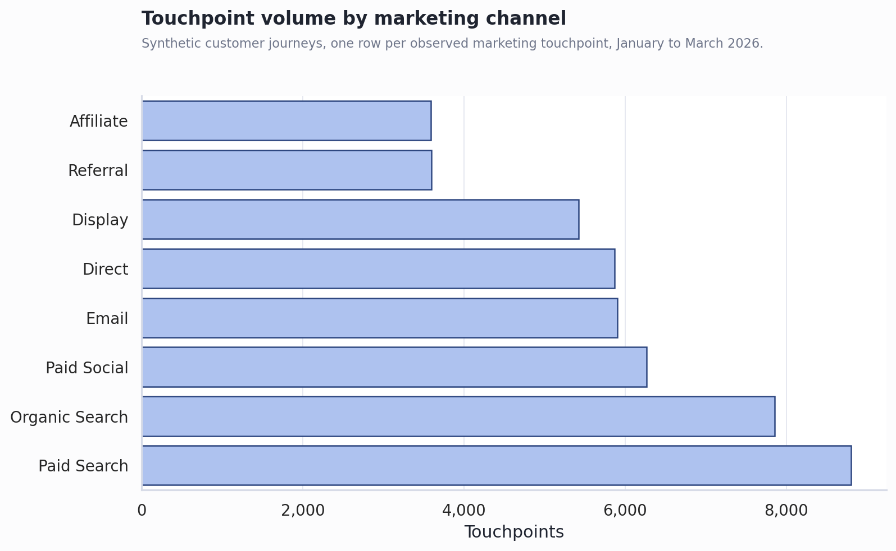

# Marketing Attribution & Budget ROI Analysis

## Executive Summary

- **Last-touch attribution materially changes channel credit.** The Markov removal model gives the most credit to Paid Search at 18.0% of synthetic converted revenue, while last-touch would credit that channel at 26.0%.
- **The budget issue is not just measurement; it is spend allocation.** A last-touch allocation would misdirect an estimated $37.8K, or 21.7% of the synthetic quarter's budget, versus the Markov-informed mix.
- **A balanced reallocation is the practical recommendation.** It estimates $21.9K revenue lift (6.4%) while avoiding the execution risk of a full model-driven swing.
- **This is correlational, not causal.** Attribution models allocate credit across observed journeys; they do not prove incremental lift without experiments or stronger causal design.

## Dataset Profile

The repository uses a deterministic synthetic dataset because a clean, directly usable, well-documented public multi-touch attribution dataset was not selected for this portfolio build. The synthetic dataset contains 47,308 touchpoints across 15,000 journeys from 2026-01-01 to 2026-04-07. Journey conversion rate is 12.7%; average journey length is 3.15 touches.

## Channel Performance Context

Channel exposure conversion rates are descriptive. They should be read as "journeys that included this channel converted at this rate," not as a causal lift claim.

| Channel | Touchpoints | Journeys Seen | Conversion Rate When Seen |
|---|---:|---:|---:|
| Email | 5,904 | 5,142 | 17.9% |
| Paid Search | 8,801 | 7,174 | 15.6% |
| Referral | 3,596 | 3,300 | 15.4% |
| Paid Social | 6,269 | 5,500 | 14.6% |
| Organic Search | 7,859 | 6,509 | 14.4% |
| Display | 5,420 | 4,907 | 14.3% |
| Affiliate | 3,587 | 3,319 | 14.3% |
| Direct | 5,872 | 5,172 | 13.6% |

## Attribution Model Comparison

First-touch and last-touch answer simple operational questions, but they throw away most journey context. The Markov removal model asks how much the overall conversion probability falls when a channel is removed from paths, then allocates converted revenue based on that removal effect.

| Channel | First Touch | Last Touch | Linear | Markov Removal |
|---|---:|---:|---:|---:|
| Affiliate | 5.8% | 6.8% | 7.0% | 7.8% |
| Direct | 4.1% | 19.3% | 10.9% | 12.4% |
| Display | 20.9% | 4.2% | 11.4% | 11.6% |
| Email | 7.7% | 21.1% | 15.1% | 14.3% |
| Organic Search | 16.4% | 11.9% | 15.4% | 15.1% |
| Paid Search | 14.7% | 26.0% | 19.7% | 18.0% |
| Paid Social | 20.9% | 5.1% | 13.0% | 12.6% |
| Referral | 9.6% | 5.5% | 7.7% | 8.2% |

## Budget Implication

The largest positive Markov budget gap is Referral at $8.3K; the largest reduction is Paid Search at $-23.6K. Positive gaps indicate channels that would receive more budget under the Markov-informed allocation; negative gaps indicate reductions.

## Scenario Recommendation

| Scenario | Estimated Revenue Lift | Lift % | Incremental ROAS | Tradeoff |
|---|---:|---:|---:|---|
| Conservative rebalance | $12.6K | 3.7% | 1.19x | Move partway toward Markov credit; lowest disruption. |
| Balanced reallocation | $21.9K | 6.4% | 1.12x | Meaningful shift while keeping channel mix diversified. |
| Aggressive Markov target | $31.2K | 9.2% | 1.04x | Fully align budget with Markov credit; highest execution risk. |

## Caveats And Assumptions

- The dataset is synthetic and calibrated for portfolio demonstration, not a real company's performance history.
- Markov attribution is correlational. It is better than last-touch for using journey sequence information, but it still cannot prove what would have happened without a channel.
- Spend response uses a simple diminishing-returns curve. Real budget decisions should be validated with incrementality tests, geo holdouts, media-mix modeling, or randomized lift studies.
- Revenue is gross synthetic order revenue. A real business case should use contribution margin or customer lifetime value after returns, discounts, and fulfillment cost.
